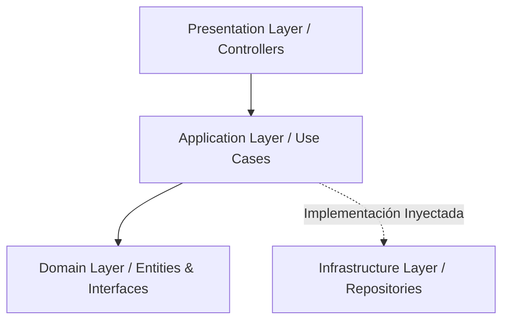

# Application Use Cases (Casos de Uso de Aplicación)

> **UBICACIÓN**: Capa de `application/use-cases`
> **PROPÓSITO**: Orquestar el flujo de datos hacia y desde las entidades de dominio, y dirigir esas entidades para que utilicen sus reglas de negocio para lograr los objetivos del caso de uso.

---

## ¿Qué es un Caso de Uso?

En Clean Architecture, los **Casos de Uso** (también llamados Interactors) representan las acciones específicas que un usuario puede realizar en el sistema. Son el "qué hace" la aplicación.

Mientras que las **Entidades** contienen las reglas de negocio globales (que cambiarían poco), los **Casos de Uso** contienen las reglas específicas de la aplicación.

### Responsabilidades Principales

1. **Orquestación**: Coordina la colaboración entre entidades de dominio y servicios externos (repositorios, gateways) a través de interfaces.
2. **Validación de Aplicación**: Verifica que se cumplan las condiciones para ejecutar la acción (ej: ¿el usuario tiene permiso?).
3. **Manejo de Entrada/Salida**: Recibe un Request DTO (Data Transfer Object) y devuelve un Response DTO.
4. **Persistencia**: Indica al repositorio cuándo guardar los cambios, pero sin saber *cómo* se guardan (independencia tecnológica).

---

## La Regla de Dependencia

Los Casos de Uso están en el círculo interno (Capa de Aplicación). 
- **Dependen de**: El `Domain` (Entidades, Interfaces, Value Objects).
- **Son dependidos por**: La capa de `Presentation` (Controllers).

---

## Ejemplo Didáctico: `RegisterUser`

Analicemos qué sucede dentro de un caso de uso como `RegisterUser`:

1.  **Recibir Datos**: Obtiene el email y password desde el controlador.
2.  **Validar**: Comprueba si el email ya existe usando una interfaz `IUserRepository`.
3.  **Crear Dominio**: Instancia una entidad `User` (aquí se aplican las reglas de negocio del dominio).
4.  **Persistir**: Llama a `userRepository.save(user)`.
5.  **Notificar**: Podría llamar a `IEmailService.sendWelcome(user)`.
6.  **Retornar**: Devuelve al controlador una confirmación o los datos del nuevo usuario.

---

## ¿Por qué usarlos?

- **Single Responsibility Principle (SRP)**: Cada archivo tiene una única razón para cambiar: el flujo de ese proceso de negocio específico.
- **Testeabilidad**: Se pueden testear fácilmente con mocks/fakes de las interfaces, sin necesidad de bases de datos o servidores HTTP.
- **Documentación Viva**: Al mirar la carpeta `use-cases`, cualquier desarrollador entiende inmediatamente qué funcionalidades ofrece el sistema.

---

## REGLA DE ORO
> "Un Caso de Uso NO debería contener lógica de negocio compleja (esa va en las Entidades o Domain Services). Solo debe **decirle a los demás qué hacer y en qué orden**."
