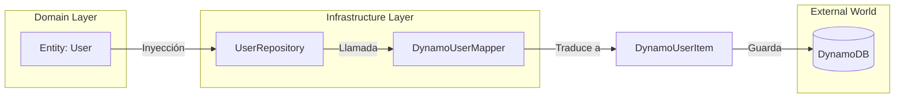

# El Poder de los Mappers: El Traductor Universal

> **UBICACIÓN**: Capa de `infrastructure/mappers`
> **PROPÓSITO**: Traducir objetos entre el lenguaje del Dominio (Entidades) y el lenguaje de la Infraestructura (Base de Datos/DTOs).

---

## 🛑 La Problemática: "La Contaminación del Dominio"

Imagina que estás usando DynamoDB con una estrategia de **Single-Table Design**. Para que funcione, necesitas guardar tus IDs con prefijos extraños como `USER#123` y usar claves llamadas `pk` (Partition Key) y `sk` (Sort Key).

Si NO usaras Mappers, tendrías dos problemas graves:
1.  **Dominio Sucio**: Tu entidad `User` tendría que llamarse `DynamoUser` y tener propiedades llamadas `pk` y `sk`. Tu lógica de negocio se llenaría de códigos de DynamoDB.
2.  **Acoplamiento Rígido**: Si mañana decides cambiar DynamoDB por PostgreSQL (donde no existen las `pk` ni los prefijos `USER#`), tendrías que reescribir toda tu lógica de negocio porque está "casada" con el formato de DynamoDB.

---

## ✅ La Solución: El Mapper (El Traductor)

El **Mapper** actúa como un traductor bilingüe que vive en la capa de Infraestructura.

*   **Dominio dice**: "Yo tengo un Usuario con ID `123` y email `test@test.com`".
*   **DynamoDB dice**: "Yo necesito un objeto con `pk: USER#123`, `sk: PROFILE` y `email: test@test.com`".

El Mapper es el que hace ese trabajo sucio de transformar uno en otro.

---

## ¿Por qué declarar una clase y métodos para esto?

Muchos desarrolladores preguntan: *¿No puedo simplemente hacer un objeto literal en el Repositorio?*

Se hace en una clase separada por 3 razones fundamentales:

1.  **Single Responsibility Principle (SRP)**: El Repositorio debe encargarse de la **persistencia** (hablar con la DB), no de la **traducción**. Si la lógica de traducción crece (ej: formatear fechas, encriptar campos), el Repositorio se volvería gigante e inmanejable.
2.  **Reutilización**: Puedes necesitar la misma traducción en varios lugares (ej: en el repositorio de usuarios y en el de sesiones).
3.  **Testeabilidad**: Puedes probar la lógica de traducción de forma aislada sin necesidad de encender una base de datos real.

---

## Visualización del Proceso



---

## Ejemplo Didáctico: `DynamoUserMapper`

Analicemos la traducción que viste en el código:

```typescript
// 1. De Dominio a Persistencia (toPersistence)
static toPersistence(user: User): DynamoUserItem {
  return {
    // REGLA DE TRADUCCIÓN: Dynamo necesita prefijos
    pk: `USER#${user.id}`, 
    sk: 'PROFILE',
    email: user.email.getValue(),
    // ... otros campos
  };
}

// 2. De Persistencia a Dominio (toDomain)
static toDomain(item: DynamoUserItem): User {
  // REGLA DE TRADUCCIÓN: Limpiamos los datos para el Dominio
  const userId = item.pk.replace('USER#', '');
  return new User(userId, new Email(item.email), ...);
}
```

---

## REGLA DE ORO
> "El Dominio nunca debe ver un prefijo de base de datos (como `USER#`). Si un prefijo llega a una Entidad, el Mapper ha fallado en su misión."
