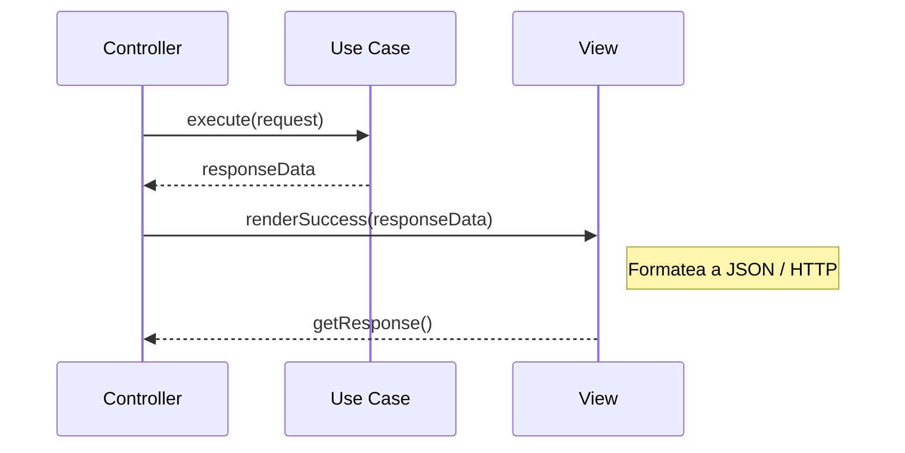

# El Rol de la View (Vistas) en Clean Architecture

> **UBICACIÓN**: Capa de `presentation/views`
> **PROPÓSITO**: Transformar los resultados del dominio (Entidades/DTOs) en un formato comprensible para el cliente final (JSON, HTML, Consola, etc.).

---

## ¿Qué es una View?

En Clean Architecture, la **View** es el último eslabón de la cadena en la capa de Presentación. Su misión es la **representación**.

Mientras que el Controlador decide *qué* hacer (llamando a un caso de uso), la View decide *cómo* mostrar el resultado. Esto permite que el mismo sistema pueda devolver una respuesta para una AWS Lambda, una página HTML o un comando de terminal sin cambiar ni una sola línea de lógica de negocio.

### Responsabilidades Principales

1.  **Formateo de Salida**: Convertir objetos de datos en strings, JSON estructurado o plantillas.
2.  **Manejo de Protocolos**: Por ejemplo, definir los `statusCode` y `headers` de HTTP si estamos en un contexto web.
3.  **Aislamiento del Cliente**: Evitar que el controlador sepa detalles técnicos de la plataforma (como los requerimientos específicos de API Gateway).

---

## Interacción en la Capa de Presentación

La View trabaja codo a codo con el **Controller**. El controlador recibe la petición, ejecuta el caso de uso y le entrega el resultado a la View.



---

## Ejemplo Didáctico: `LambdaView`

Analicemos cómo implementamos esto para AWS Lambda en nuestro proyecto:

```typescript
/**
 * REGLA DE PRESENTACIÓN: 
 * La View conoce el formato externo (API Gateway), 
 * pero no conoce las reglas de negocio.
 */
export class LambdaView {
    // 1. Estado interno para almacenar la respuesta formateada
    private response: any = null;

    // 2. Método para formatear un éxito
    renderSuccess(data: any): void {
        // REGLA: Convertimos los datos a un formato que AWS API Gateway entienda (statusCode 200)
        this.response = {
            statusCode: 200,
            headers: { "Content-Type": "application/json" },
            body: JSON.stringify(data)
        };
    }

    // 3. Método para formatear un error
    renderError(error: string): void {
        this.response = {
            statusCode: 400,
            body: JSON.stringify({ error })
        };
    }

    // 4. Método para extraer el resultado final
    getResponse() {
        return this.response;
    }
}
```

---

## ¿Por qué no usar `res.json()` directamente en el Controller?

Si usas directamente una librería web (como Express) en el controlador:
-   **Problema**: Tu controlador queda "casado" con esa librería. Si quieres mover tu código a una Lambda o a un Microservicio con otro framework, tienes que reescribir los controladores.
-   **Solución con View**: El controlador solo dice "renderiza esto". Si cambias de Express a AWS Lambda, solo cambias la implementación de la View inyectada en el `main.ts` (Composition Root).

---

## REGLA DE ORO
> "La View NO debe parsear inputs ni validar lógica de negocio. Su única misión es **formatear la salida** para que el cliente la entienda."
