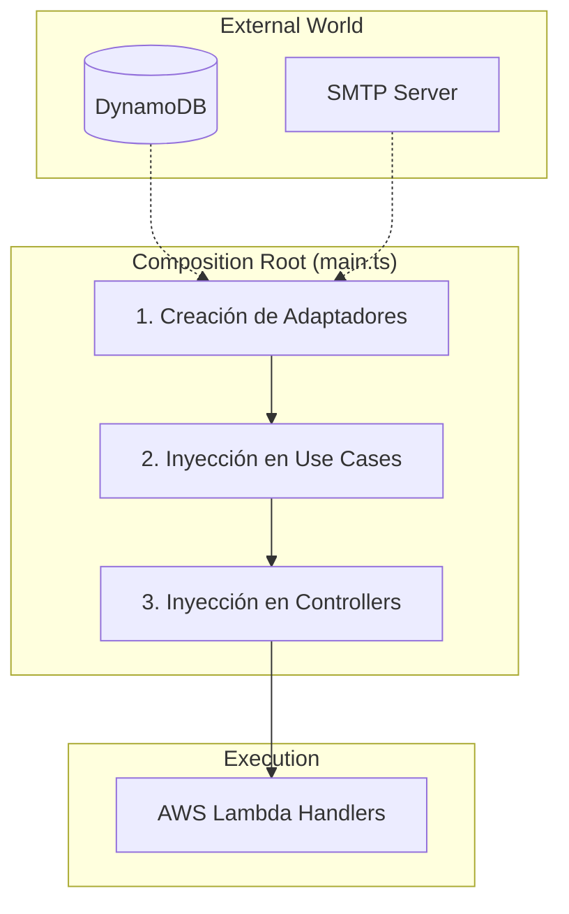

# Entendiendo el main.ts (Composition Root)

> **UBICACIÓN**: Raíz del proyecto (`src/main.ts`)
> **PROPÓSITO**: Actuar como el "Pegamento del Sistema". Es el único lugar donde se crean las instancias reales de las clases y se inyectan en sus consumidores.

---

## ¿Qué es el Composition Root?

En una aplicación que sigue Clean Architecture, las capas internas (Dominio y Aplicación) no deben saber nada de las capas externas (Infraestructura). Sin embargo, en algún momento, el programa tiene que "unir" las piezas para poder funcionar.

El **Composition Root** es el lugar centralizado donde:
1. Se configuran las tecnologías (DB, Email, Queues).
2. Se resuelven las dependencias (Inyección de Dependencias).
3. Se exponen los puntos de entrada (Handlers para AWS Lambda).

---

## El Orden de Construcción (El Grafo)

Para que el sistema arranque, debemos construir las dependencias desde lo más externo hacia lo más interno. En `main.ts` verás este orden lógico:

### 1. Infraestructura (Adaptadores)
Primero creamos las implementaciones concretas que hablan con el mundo real.
```typescript
// REGLA: Aquí es el ÚNICO lugar donde mencionamos nombres de tecnologías.
const userRepo = new DynamoDbUserRepository(tableName);
const emailService = new SmtpEmailClient();
```

### 2. Dominio y Aplicación (Lógica)
Luego inyectamos esos adaptadores en nuestros casos de uso. Los casos de uso solo ven la **interfaz**, no la clase concreta.
```typescript
// RegisterUser no sabe que usa DynamoDB, solo sabe que usa un IUserRepository.
const registerUser = new RegisterUser(userRepo, emailService, userPolicy);
```

### 3. Presentación (Controladores)
Finalmente, entregamos los casos de uso a los controladores.
```typescript
const userController = new UserController(registerUser, loginUser, logoutUser, view);
```

---

## Visualización del Ensamblaje



---

## ¿Por qué es tan importante este archivo?

1.  **Single Point of Change**: Si decides cambiar DynamoDB por MongoDB, solo tienes que cambiar una línea en este archivo. El resto de tu aplicación (99% del código) no se entera del cambio.
2.  **Facilita el Testing**: Al centralizar la creación de objetos, es muy fácil intercambiar una implementación real por un "Mock" o "Fake" para pruebas.
3.  **Clean Code**: Evita que los controladores tengan que hacer `new DynamoDB(...)` dentro de sus métodos, manteniendo las capas limpias y enfocadas.

---

## REGLA DE ORO
> "Si encuentras la palabra 'new' instanciando una clase de Infraestructura (como una Base de Datos o un Cliente API) fuera del `main.ts`, probablemente estés rompiendo la Regla de Dependencia."
