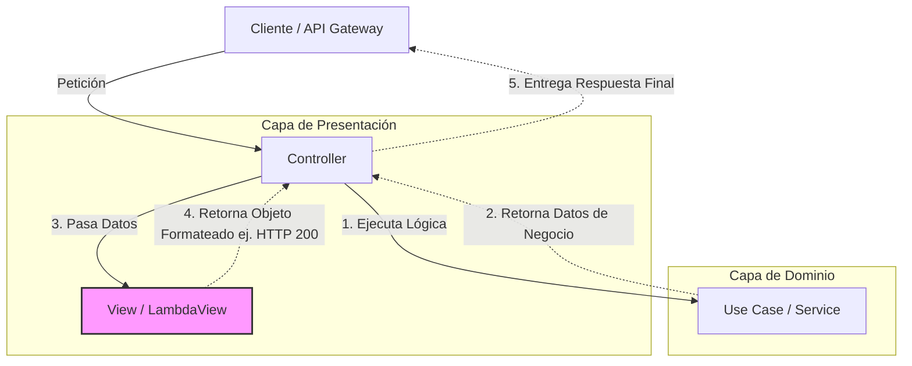

# ¿Qué es una Vista (View) en Clean Architecture?

```typescript
/**
 * Archivo: LambdaView.ts (Ejemplo de Implementación)
 * UBICACIÓN: Capa de Presentation / views
 *
 * ¿QUÉ ES UNA VISTA (VIEW)?
 * - Es el componente final de la capa de Presentación encargado de dar formato a los datos antes de entregarlos al consumidor final.
 * - Responsabilidades principales: Tomar datos en crudo (normalmente de un DTO o Serializador) y estructurarlos en el formato exacto que espera el cliente (JSON, HTML, respuestas de AWS API Gateway, etc.), incluyendo códigos de estado y cabeceras.
 *
 * - Para quién trabaja: Para el Controlador (Controller).
 * - Intención: Aislar completamente la lógica de formateo de entrega de la lógica de orquestación del controlador.
 * - Misión: Asegurar que la respuesta cumpla con el contrato estricto del cliente que hace la petición, manejando los detalles sucios del protocolo (como HTTP).
 */
```

## 🍽️ Analogía del Mundo Real: El Restaurante Elegante

Imagina que estás en un restaurante de alta cocina:
- El **Caso de Uso (Dominio)** es el *Chef* que cocina el platillo con los mejores ingredientes.
- El **Controlador** es el *Mesero* que toma tu orden y trae el platillo terminado desde la cocina.
- La **Vista (View)** es el *Especialista en Emplatado* (Plater).

Al Chef no le importa si el plato es cuadrado, redondo, o si lleva una salsa decorativa para la foto de Instagram; su trabajo es que la comida sepa bien y siga la receta. El Especialista en Emplatado toma esa comida perfecta (los datos) y la acomoda meticulosamente en el plato adecuado para impresionar al cliente final.

## ⚖️ Problemática y Solución (Trade-offs)

- **El problema que resuelve:** En muchos frameworks, es muy común mezclar todo en el Controlador: validar la entrada, llamar a la base de datos, aplicar la lógica y, finalmente, construir a mano el JSON con los headers `200 OK` y el `body`. Si mañana cambian los estándares de tu empresa para responder errores (ej. de `{ "error": "msg" }` a `{ "errors": [{ "code": 1, "detail": "msg" }] }`), tendrías que modificar cada uno de los controladores de tu proyecto.
- **¿Qué pasa si NO lo usamos?** Terminamos con controladores "gordos", acoplados fuertemente a detalles de infraestructura como HTTP (en el caso de `LambdaView`, a la estructura exacta de un evento de AWS API Gateway). Esto hace que el código sea rígido, repetitivo y difícil de probar.
- **La solución:** Al usar una Vista, el Controlador se vuelve súper limpio. Solo dice: *"Aquí están los datos procesados, devuélvelos como un éxito"* o *"Hubo un error de negocio, formatea un mensaje de error"*.

## 🏗️ Contexto de Clean Architecture

Siguiendo la Regla de Dependencia, la **View** vive estrictamente en la capa de **Presentation**. Es el límite exterior de nuestra aplicación. 

La Vista mira hacia "afuera", preocupándose solo por cómo el mundo exterior consume la información. Nunca contiene lógica de negocio; solo aplica reglas de transformación y formato final. Esto nos permite cambiar nuestro mecanismo de entrega (de Express.js a AWS Lambda, o a gRPC) creando simplemente una nueva `View`, sin tocar nuestros Controladores ni Casos de Uso.

## 💻 Código de Ejemplo

```typescript
// 1. Definimos un contrato o puerto para nuestras vistas.
// El controlador solo dependerá de esta interfaz, no de la implementación.
export interface IView {
  renderSuccess(data: any): any;
  renderError(error: Error): any;
}

// 2. Implementación concreta para AWS Lambda (LambdaView)
export class LambdaView implements IView {
  
  // 3. Método para formatear el final feliz (Happy Path)
  renderSuccess(data: any) {
    // REGLA DE NEGOCIO: Toda respuesta exitosa en nuestra API debe tener 
    // status 200 y envolver la respuesta en un estándar con 'success: true'.
    return {
      statusCode: 200,
      headers: {
        'Content-Type': 'application/json',
        'Access-Control-Allow-Origin': '*' // CORS
      },
      // AWS Lambda espera que el body sea un string JSON
      body: JSON.stringify({
        success: true,
        data: data
      })
    };
  }

  // 4. Método para formatear los casos de error
  renderError(error: Error) {
    // REGLA DE NEGOCIO: Nunca exponer stack traces o errores internos de 
    // base de datos al cliente. Formatear a un mensaje genérico controlado.
    return {
      statusCode: 400, // Podría ser dinámico dependiendo del tipo de error
      headers: {
        'Content-Type': 'application/json'
      },
      body: JSON.stringify({
        success: false,
        error: error.message
      })
    };
  }
}
```

## 🗺️ Visualización de la Arquitectura



## 🤔 Pregunta Reflexiva

Pensando en este nivel de desacoplamiento: Si en el futuro decidieras que tu aplicación, además de exponer una API REST (JSON), también debe poder ser utilizada a través de una consola de comandos (CLI) que imprima texto en colores en la terminal... 

¿Qué piezas específicas tendrías que crear nuevas, y de qué manera la existencia del patrón `View` evita que tengas que reescribir tus Casos de Uso y Controladores?
