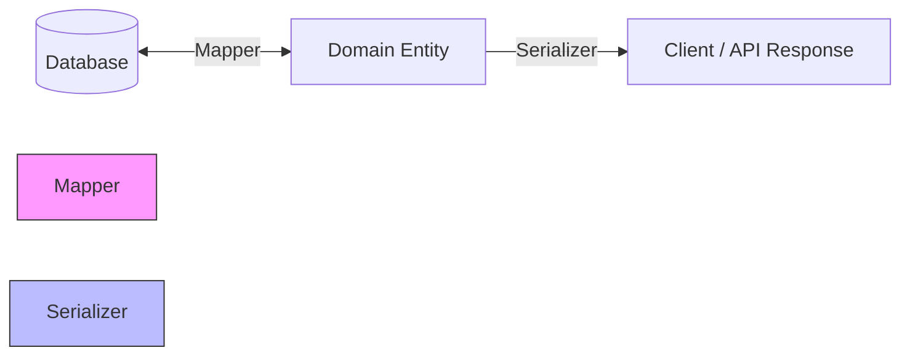

# Mappers vs Serializers: ¿Cuál es la diferencia?

> **RESUMEN RÁPIDO**: Los **Mappers** traducen para la Base de Datos (hacia atrás), mientras que los **Serializers** traducen para el Cliente/API (hacia adelante).

---

## 🛑 La Problemática: El "Todo en Uno"

Sin estos componentes, tu Entidad de Dominio tendría que saber demasiadas cosas:
1.  Cómo se llama la columna en la base de datos (`user_id`).
2.  Qué campos son secretos y no deben enviarse al frontend (`password_hash`).
3.  Cómo quiere el frontend ver los datos (ej: cambiar `true` por `"Active"`).

Si mezclas todo esto en la Entidad, creas un objeto gigante, difícil de testear y muy frágil.

---

## ✅ La Solución: Dos Traductores Especializados

### 1. Mapper (Capa de Infraestructura)
**Foco**: Persistencia.
- **Misión**: Traducir entre la Entidad y la Base de Datos.
- **Dirección**: Bidireccional (`toDomain` y `toPersistence`).
- **Detalles**: Maneja prefijos de DB, tipos de datos de almacenamiento (ej: 0/1 en lugar de booleanos) y nombres de tablas.

### 2. Serializer (Capa de Presentación)
**Foco**: Entrega.
- **Misión**: Transformar la Entidad en una respuesta segura y amigable para el cliente.
- **Dirección**: Unidireccional (`serialize`). Rara vez transformas un JSON de salida de vuelta a dominio (para eso usas un `RequestMapper` o `Deserializer`).
- **Detalles**: **OCULTA DATOS SENSIBLES**, formatea fechas, traduce estados y limpia la respuesta.

---

## Comparativa Técnica

| Característica | Mapper | Serializer |
| :--- | :--- | :--- |
| **Ubicación** | `infrastructure/mappers` | `presentation/serializers` |
| **Audiencia** | La Base de Datos (Dynamo, SQL) | El Cliente (Web, App, API) |
| **Sentido** | Entrada y Salida (↔️) | Salida (➡️) |
| **Seguridad** | Maneja datos sensibles (hashes, tokens) | **Elimina** datos sensibles |

---

## Visualización en Clean Architecture



---

## Ejemplo en el Proyecto

### Mapper (Habla con DynamoDB)
```typescript
// En DynamoUserMapper
return {
  pk: `USER#${user.id}`, // Prefijo técnico de Dynamo
  passwordHash: user.passwordHash // La DB SÍ necesita el hash
};
```

### Serializer (Habla con el Usuario)
```typescript
// En UserSerializer
return {
  id: user.id,
  status: user.isActive ? 'Active' : 'Inactive', // Traducción amigable
  // ELIMINAMOS passwordHash por seguridad
};
```

---

## REGLA DE ORO
> "Usa un **Mapper** cuando no quieras que tu Dominio sepa cómo guardas los datos. Usa un **Serializer** cuando no quieras que tu Cliente sepa cómo guardas los datos (o qué secretos tienes)."
