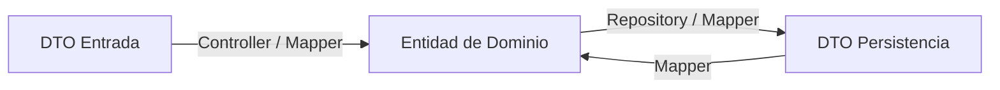

# Los DTO (Data Transfer Objects) en Clean Architecture

> **UBICACIÓN**: `presentation/dtos` y `infrastructure/dtos`
> **PROPÓSITO**: Actuar como contenedores de datos planos para mover información entre capas o procesos sin exponer la lógica interna de las Entidades de Dominio.

---

## ¿Qué es un DTO?

Un **DTO** es una "bolsa de datos". No tiene comportamiento, no tiene validaciones de negocio complejas y, por lo general, solo contiene propiedades con tipos primitivos.

Su misión es **transportar datos**. 

### ¿Por qué no usar Entidades de Dominio en su lugar?
Si envías una **Entidad** directamente al cliente (API) o la guardas directamente en la DB:
1.  **Expones secretos**: Podrías enviar accidentalmente el `passwordHash` al frontend.
2.  **Acoplamiento**: Si cambias un nombre de campo en tu base de datos, tendrías que cambiar tu lógica de negocio (Entidad).
3.  **Rigidez**: La base de datos puede querer `snake_case`, el dominio `camelCase` y el frontend algo distinto. Los DTOs permiten estas traducciones.

---

## Tipos de DTOs en este Proyecto

En Clean Architecture, solemos tener DTOs en las fronteras (Input y Output):

### 1. DTOs de Entrada (Request DTOs)
Ubicados en `presentation/dtos`. Definen lo que el cliente nos envía.
- **Ejemplo**: `RegisterUserDto` { email, password }.
- **Misión**: Ser el contrato de entrada para el Controlador.

### 2. DTOs de Persistencia (Infrastructure DTOs)
Ubicados en `infrastructure/dtos`. Definen cómo se ven los datos en el medio de almacenamiento.
- **Ejemplo**: `UserPersistenceDTO` { user_id, email_address, password_hash }.
- **Misión**: Ser el contrato entre el Repositorio y la Base de Datos.

---

## El Flujo de Transformación (Mappers)

Los DTOs nunca entran al corazón del sistema (Dominio). Para eso usamos **Mappers**:

1.  **Controller**: Recibe `RequestDTO` -> Llama a un Mapper -> Crea la **Entidad**.
2.  **Repository**: Recibe **Entidad** -> Llama a un Mapper -> Crea el `PersistenceDTO` -> Lo guarda.

---

## REGLA DE ORO
> "Un DTO es tonto. Si ves un `if`, un `loop` o lógica de cálculo dentro de un DTO, lo estás convirtiendo en una Entidad y rompiendo el patrón."
