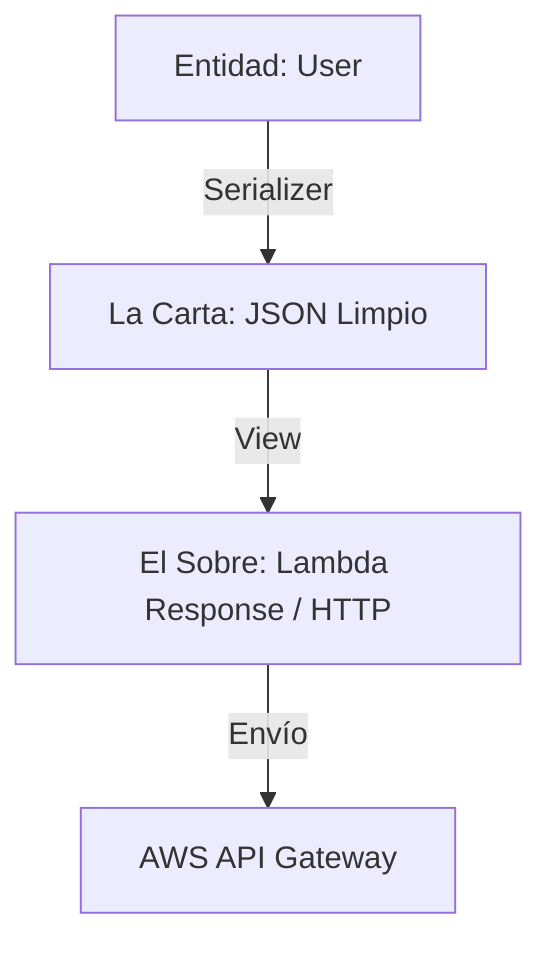

# ¿Por qué separar Serialización de Vistas? (Dos pasos)

> **UBICACIÓN**: `presentation/serializers` vs `presentation/views`
> **PROPÓSITO**: Diferenciar entre **qué** datos se muestran (Serialización) y **cómo** se entregan técnicamente (Vista).

---

## 🛑 La Problemática: La Vista "Sabelotodo"

Si pusiéramos la serialización dentro de la `LambdaView`, tendríamos un problema de **acoplamiento** y **explosión de clases**:

1.  **Acoplamiento al Dominio**: La `LambdaView` tendría que conocer la entidad `User` para saber que debe ocultar el `passwordHash`.
2.  **Explosión de Clases**: Tendrías que crear una `UserLambdaView`, una `OrderLambdaView`, una `ProductLambdaView`... cada una repitiendo la lógica de cómo formatear una respuesta de AWS Lambda.
3.  **Rigidez**: Si mañana quieres mostrar el usuario en la consola, tendrías que crear una `UserConsoleView` y volver a escribir la lógica de ocultar el password.

---

## ✅ La Solución: Dos Pasos, Dos Responsabilidades

En Clean Architecture, dividimos la tarea en dos especialistas:

### 1. El Serializer (La Lógica de "Qué")
- **Responsabilidad**: Transformar una Entidad de Dominio en un Objeto Plano (JSON).
- **Misión Crítica**: **Seguridad**. Decide qué campos se van (id, email) y cuáles se quedan (passwordHash).
- **Reutilización**: El `UserSerializer` es agnóstico a la tecnología. Sirve para una API, para un log o para un sistema de mensajería.

### 2. La View (La Lógica de "Cómo")
- **Responsabilidad**: Envolver un objeto plano en un sobre técnico (headers, status codes, formato Lambda).
- **Misión Crítica**: **Entrega**. Se asegura de que AWS o el navegador entiendan el mensaje.
- **Reutilización**: La `LambdaView` es genérica. No sabe si está renderizando un usuario, una orden o un error. Solo sabe que debe devolver un `statusCode: 200`.

---

## Visualización: El Sobre y la Carta



1.  **Serializer**: Escribe la carta y decide qué secretos omitir.
2.  **View**: Mete la carta en el sobre, le pone el sello (status code) y la dirección (headers).

---

## ¿Por qué es mejor así?

### Flexibilidad Total
Si cambias de AWS Lambda a una Consola, el código del controlador se vería así:
```typescript
// PASO 1: La serialización NO CAMBIA (sigue siendo UserSerializer)
const data = UserSerializer.serialize(user);

// PASO 2: Solo cambias la View inyectada
this.consoleView.renderSuccess(data); 
```

### Código más limpio (DRY)
Nuestra `LambdaView` es **genérica**. Puede renderizar cualquier cosa que le pases:
```typescript
renderSuccess(data: any): void {
    this.response = {
        statusCode: 200,
        body: JSON.stringify(data) // No le importa qué hay dentro de 'data'
    };
}
```

---

## REGLA DE ORO
> "El **Serializer** protege tu dominio (seguridad). La **View** protege tu controlador de la tecnología (infraestructura de entrega). Juntos, mantienen tu sistema flexible ante cualquier cambio."
