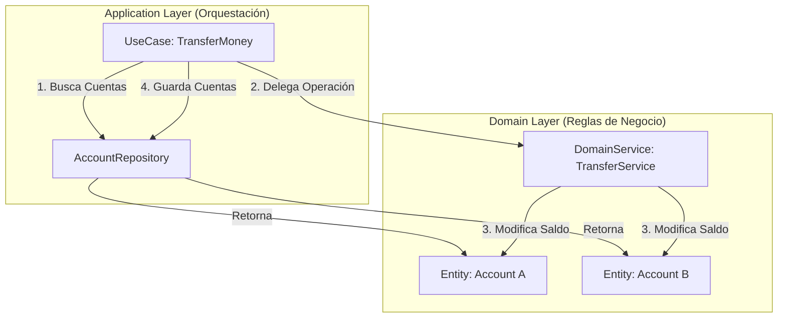

# Servicios de Dominio: Validadores, Calculadores y Árbitros

> **UBICACIÓN**: Capa de `domain/services`
> **PROPÓSITO**: Encapsular reglas de negocio transversales, validaciones complejas o cálculos que involucran a múltiples entidades y que no encajan naturalmente en ninguna de ellas por separado.

---

## 🛑 La Problemática: Operaciones que involucran múltiples entidades

Tienes razón al decir que los Servicios de Dominio actúan como **validadores** para los Casos de Uso. Pero, ¿qué pasa cuando la regla de negocio no es solo una validación, sino una **operación** entre varias entidades?

Imagina una aplicación bancaria donde necesitas transferir dinero de una `Account` (Cuenta A) a otra `Account` (Cuenta B).
1.  **¿Lo ponemos en la entidad `Account`?** Hacer `cuentaA.transferirA(cuentaB, monto)` se siente raro. ¿Por qué la Cuenta A debe tener la responsabilidad de modificar el saldo de la Cuenta B? Se rompe la cohesión.
2.  **¿Lo ponemos en el Caso de Uso `TransferMoney`?** El caso de uso orquesta, pero la lógica de restar, sumar y verificar límites de sobregiro es **lógica de negocio core**, no de aplicación. Si pones el `if (cuentaA.saldo < monto)` en el Caso de Uso, estás filtrando dominio hacia la aplicación.

---

## ✅ La Solución: El Servicio de Dominio como Árbitro

Un **Domain Service** no es *solo* un validador; es un **árbitro** o coordinador de lógica puramente de dominio.

Respondiendo a tu afirmación:
**Sí, validan los casos de uso**, proveyendo las reglas ("¿Se permite este email?").
**Pero también calculan y operan**, realizando acciones que las entidades no pueden hacer solas ("Transfiere este dinero de A hacia B respetando las reglas de ambas").

### ¿Por qué se hace así?
- **Evita el "Feature Envy" (Envidia de Funcionalidad)**: Evita que una entidad acceda demasiado a los datos de otra entidad.
- **Mantiene las Entidades Puras**: Las entidades se enfocan en su propio estado.
- **Reusabilidad de la Lógica**: El cálculo de una transferencia o la validación de un email prohibido pueden ser usados por múltiples Casos de Uso (ej: `TransferMoneyUseCase`, `PayBillUseCase`).

---

## Contexto en Clean Architecture

En Clean Architecture, el flujo ideal cuando un Caso de Uso necesita aplicar una regla compleja es:

1. El **Caso de Uso** recupera las Entidades (usando Repositorios).
2. El **Caso de Uso** le pasa las Entidades al **Servicio de Dominio**.
3. El **Servicio de Dominio** aplica la regla de negocio, hace el cálculo o la validación.
4. El **Caso de Uso** toma el resultado y persiste los cambios.



---

## Ejemplo Didáctico: Más allá de la validación

Mientras que el `UserPolicyService` (que ya vimos) actúa como validador, veamos un ejemplo conceptual de un Servicio de Dominio actuando como "Operador":

```typescript
// UBICACIÓN: domain/services/TransferService.ts

export class TransferService {
  /**
   * REGLA DE NEGOCIO: Transferencia entre cuentas.
   * El servicio de dominio recibe las dos entidades y coordina 
   * la regla de negocio pura entre ellas.
   */
  public transfer(fromAccount: Account, toAccount: Account, amount: Money): void {
    // 1. REGLA DE NEGOCIO: ¿Tiene fondos? (Validación)
    if (!fromAccount.hasSufficientFunds(amount)) {
      throw new InsufficientFundsException();
    }

    // 2. REGLA DE NEGOCIO: ¿Supera el límite de transferencia diario? (Validación cruzada)
    // ...

    // 3. OPERACIÓN DE DOMINIO: Ejecuta el cambio de estado en ambas entidades
    fromAccount.withdraw(amount);
    toAccount.deposit(amount);
  }
}
```

En el Caso de Uso (`TransferMoneyUseCase`), solo verías:
```typescript
// Dentro del execute() del Use Case:
const accountA = await this.accountRepo.findById(req.fromId);
const accountB = await this.accountRepo.findById(req.toId);

// Delega la REGLA DE NEGOCIO al Domain Service
this.transferService.transfer(accountA, accountB, req.amount);

// El Use Case hace la PERSISTENCIA
await this.accountRepo.save(accountA);
await this.accountRepo.save(accountB);
```

---

## REGLA DE ORO
> "Usa un **Servicio de Dominio** cuando una regla de negocio o cálculo requiere leer o modificar el estado de múltiples entidades, o cuando la regla conceptualmente no pertenece a ninguna entidad en particular (como una política transversal)."
