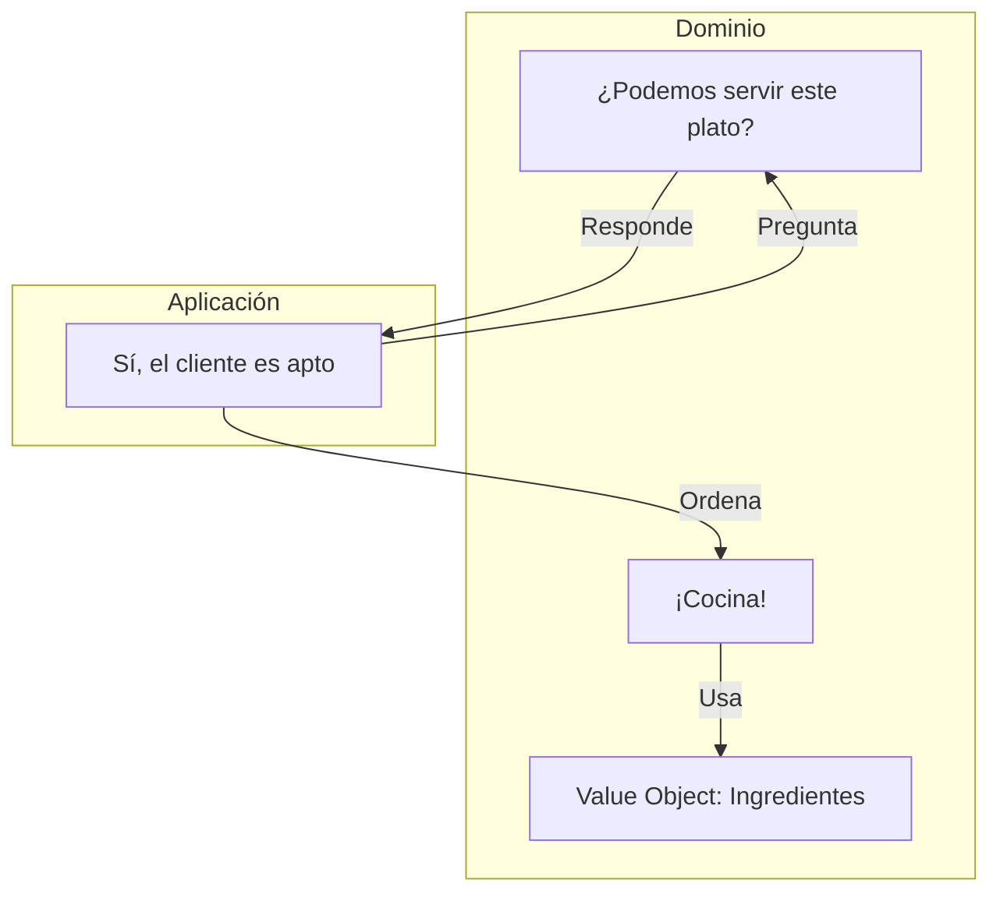

# Los Servicios de Dominio: El Manual de Reglas Puras

> **UBICACIÓN**: Capa de `domain/services`
> **PROPÓSITO**: Encapsular lógica de negocio que no pertenece naturalmente a una sola Entidad o Value Object, y que es demasiado importante para estar "mezclada" con la coordinación de un Caso de Uso.

---

## 🛑 La Problemática: ¿Dónde pongo esta regla?

A veces tienes reglas de negocio que se sienten "huérfanas":
- **No caben en el Value Object**: El VO `Email` debe validar que el texto tenga un `@`. Pero, ¿debe saber que "evil.com" está prohibido? Probablemente no, porque la sintaxis de un email es universal, pero la lista de dominios prohibidos es una decisión de **tu negocio**.
- **No caben en la Entidad**: La entidad `User` sabe cambiar su password o desactivarse. Pero la regla de "solo permitimos usuarios de ciertos países" es algo que aplica a *todos* los usuarios, no es un comportamiento de un usuario individual.
- **No deben estar en el Caso de Uso**: Si pones el `if (email.includes('evil.com'))` dentro del Use Case, estás mezclando **coordinación** (llamar al repo, enviar email) con **reglas de negocio**. Si la regla cambia, tienes que modificar el flujo, lo cual rompe el principio de Open/Closed.

---

## ✅ La Solución: El Domain Service (El "Decisor")

Un **Domain Service** es una clase pura que **solo decide**. No sabe qué es una base de datos, no sabe qué es un email, no sabe qué es un controlador. Solo recibe objetos de dominio y dice si cumplen las reglas o no.

### Diferencia Vital: Domain Service vs Use Case

| Característica | Domain Service (Dominio) | Use Case (Aplicación) |
| :--- | :--- | :--- |
| **Misión** | **Decidir** (Validar reglas puras) | **Coordinar** (Manejar el flujo) |
| **Dependencias** | **Ninguna** (Solo otros objetos de dominio) | **Puertos** (Repositorios, Gateways) |
| **Naturaleza** | Sincrónico y determinista | Asincrónico (I/O) |
| **Ubicación** | Corazón del sistema | Capa intermedia |

---

## Visualización: El Restaurante Clean



---

## Ejemplo Didáctico: `UserPolicyService`

```typescript
export class UserPolicyService {
  // REGLA DE NEGOCIO PURA
  validateEmailAllowed(email: Email): void {
    const forbiddenDomains = ['evil.com'];
    
    // El servicio solo mira el dato y decide.
    // No guarda nada en DB ni envía alertas.
    if (forbiddenDomains.some(d => email.getValue().endsWith(d))) {
      throw new Error("Dominio no permitido por política de empresa");
    }
  }
}
```

---

## ¿Por qué son necesarios?

1.  **Testeo Ultra-Rápido**: Como no tienen dependencias, puedes testear todas tus reglas de negocio en milisegundos sin usar Mocks complejos.
2.  **Reutilización**: Diferentes casos de uso (Registro, Cambio de Email, Invitación) pueden usar el mismo `UserPolicyService`.
3.  **Flexibilidad**: Si mañana el negocio decide que ahora se permiten todos los dominios, solo cambias el Service. El flujo del Caso de Uso permanece intacto.

---

## REGLA DE ORO
> "Si tu lógica de negocio involucra llamar a un `await` (base de datos o API), es un **Caso de Uso**. Si tu lógica de negocio es un cálculo o una validación pura de 'sí o no', es un **Domain Service**."
