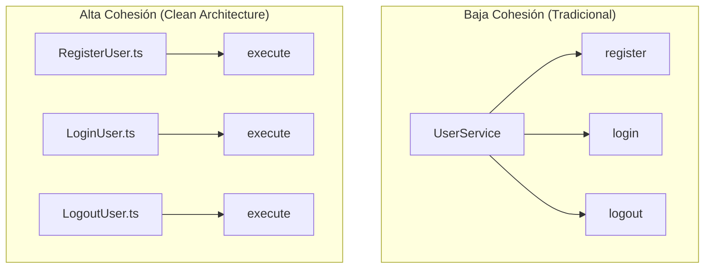

# Un solo método por Caso de Uso y el concepto de Cohesión

> **UBICACIÓN**: Capa de `application/use-cases`
> **PROPÓSITO**: Garantizar que cada clase tenga una única razón de existir y que su intención de negocio sea cristalina.

---

## 🛑 La Problemática: El "Service" Gigante (Baja Cohesión)

En arquitecturas tradicionales (como MVC clásico), solemos crear clases llamadas `UserService`. Con el tiempo, estas clases se convierten en "Clases Dios" que contienen:
- `register()`
- `login()`
- `updateProfile()`
- `deleteAccount()`
- `sendPasswordReset()`
- ... y 20 métodos más.

**¿Qué problemas causa esto?**
1.  **Baja Cohesión**: La clase hace muchas cosas que no están necesariamente relacionadas entre sí.
2.  **Dependencias Infladas**: Para que `UserService` funcione, necesita inyectar 10 repositorios y 5 servicios, aunque el método `login()` solo use uno de ellos.
3.  **Dificultad de Mantenimiento**: Si dos desarrolladores tocan el mismo archivo `UserService` para tareas distintas, habrá conflictos de código (merge conflicts) constantes.

---

## ✅ La Solución: Un Caso de Uso = Una Intención (Alta Cohesión)

En Clean Architecture, dividimos ese `UserService` en clases pequeñas y granulares: `RegisterUser`, `LoginUser`, `DeleteUser`, etc. Cada una tiene **un solo método público** (normalmente llamado `execute`).

### ¿Qué es la Cohesión?
La **Cohesión** es la medida en que los elementos de un módulo (clase/archivo) permanecen juntos porque son parte de una misma tarea. 
- **Alta Cohesión (Lo que buscamos)**: Todas las líneas de código dentro de la clase `RegisterUser` están ahí para un solo fin: registrar al usuario. Nada sobra.
- **Baja Cohesión (Lo que evitamos)**: Una clase que tiene métodos que no tienen nada que ver entre sí (ej: una clase que gestiona usuarios y también genera facturas).

---

## ¿Por qué un solo método mejora la Cohesión?

1.  **Enfoque Absoluto**: Si la clase solo tiene `execute()`, no hay espacio para "colar" lógica que no pertenezca a ese caso de uso.
2.  **Dependencias Mínimas**: El caso de uso solo inyecta lo que necesita para *esa* acción. `LogoutUser` solo necesita el repositorio de sesiones, nada más.
3.  **Arquitectura que "Grita" (Screaming Architecture)**: Al abrir la carpeta `use-cases`, ves una lista de archivos que parecen una lista de deseos del usuario: "Registrar Usuario", "Pagar Orden", "Cerrar Sesión". La arquitectura te **grita** qué hace el sistema.

---

## Visualización: Del Service al Use Case



---

## Ejemplo Didáctico: El método `execute`

```typescript
export class LogoutUser {
  // Solo inyectamos lo necesario para ESTA acción
  constructor(private sessionRepo: ISessionRepository) {}

  // Único punto de entrada: Intención clara
  async execute(token: string): Promise<void> {
    // 1. Lógica específica de logout
    await this.sessionRepo.delete(token);
  }
}
```

---

## REGLA DE ORO
> "Si sientes la tentación de añadir un segundo método público a tu Caso de Uso, pregúntate: ¿Es esta una tarea distinta? Si la respuesta es sí, crea un nuevo archivo. **Divide y vencerás.**"
